# Lesson 8

In this lesson we cover design principles, specifically the following:

1. Don Norman's Six Principles
2. Constantine's and Lockwood's Six Principles
3. Nielsen's Ten Heuristics design and evaluation
4. Seven Principles of Universal Design

## 15 Priciples
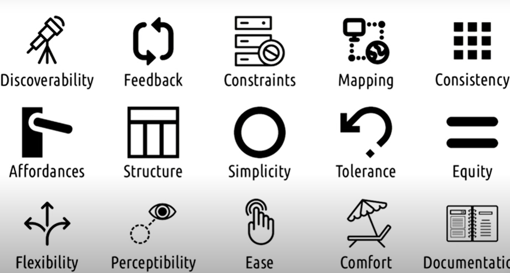

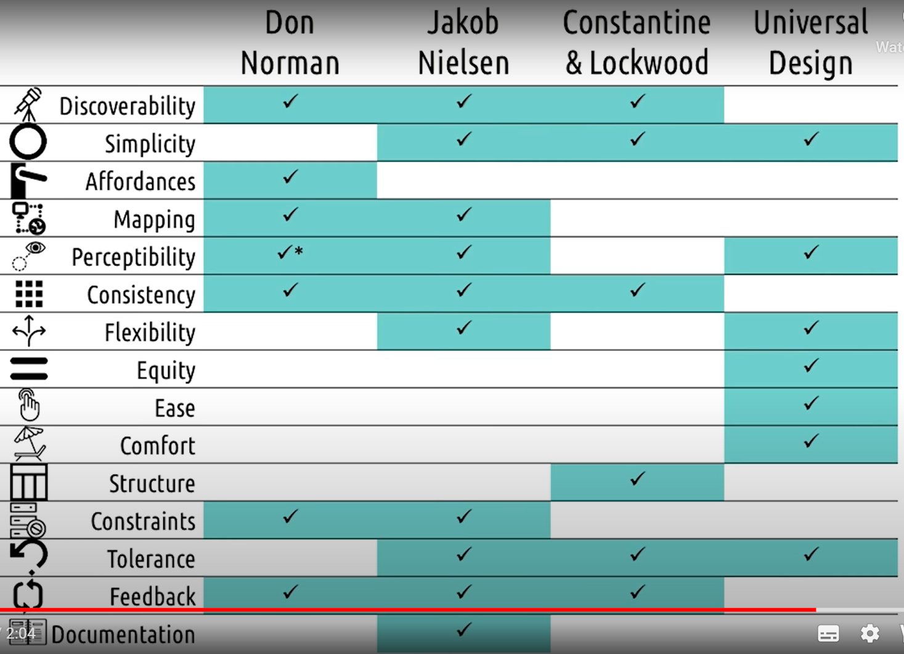

- **Discoverability** - relevant function should be made visible so the user can discover them as opposed to having to read about them in some documentation or learn them through some tutorials
	- when user doesnt know what to do, they should be able to figure out what to do
	- Dont go crazy (constantine and lockwood)

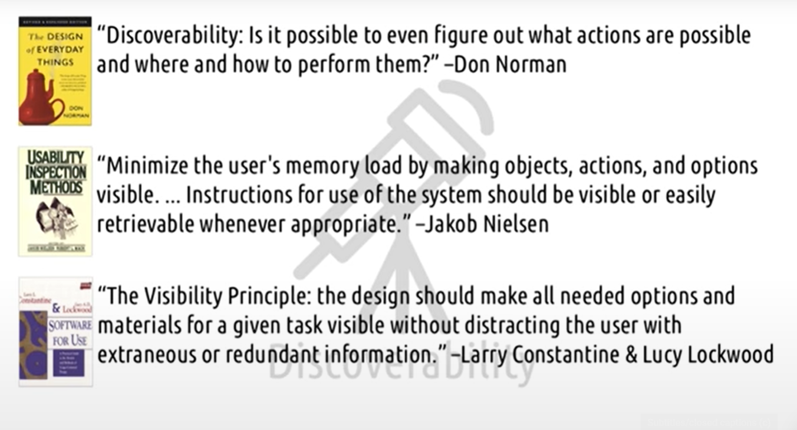

- **Simplicity** 
	- There is often tension between discoverability and simplicity. One argues to be seen and on argues to keep the interface simple, a balance between these two is often required.
	- use of design is easy to understand, regardless of user's experience, knowledge, language skills, or current concentration level
	- user should be given only whats needed.

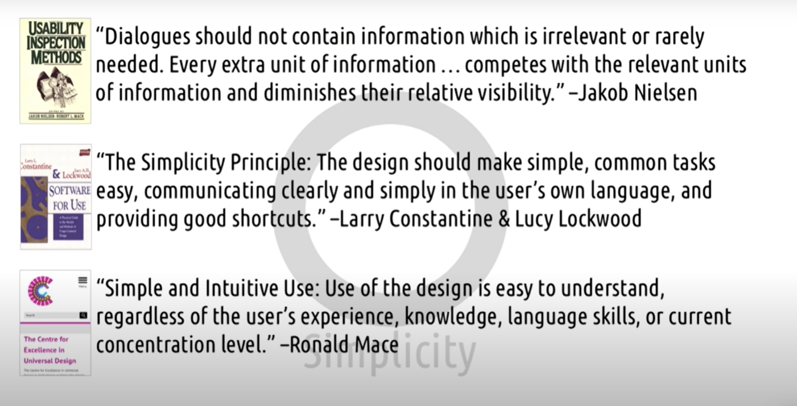

- **Affordances** - the design of the thing affords or hints at the way it's suppose to be used.
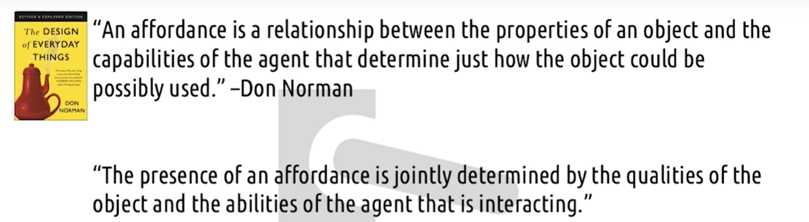
	- Signifiers are meant to close the gap between the affordance of an object (how the object suggests it should be used) and the perceived affordance (what the user thinks on how the object should be used).
		- Affordance - Inherhent property of device. We cant introduce it.
		- Perceived - What human perceives. But it can be wrong.
		- Signifier - It helps perceived affordance = Affordance

- **Mapping** -
	- Relationship between two things
	- Mapping user - worlds (cut copy paste)
	- refers to creating interfaces where the design makes it clear what the effect will be when using them (this is different than affordances where affordances suggests how to use objects)
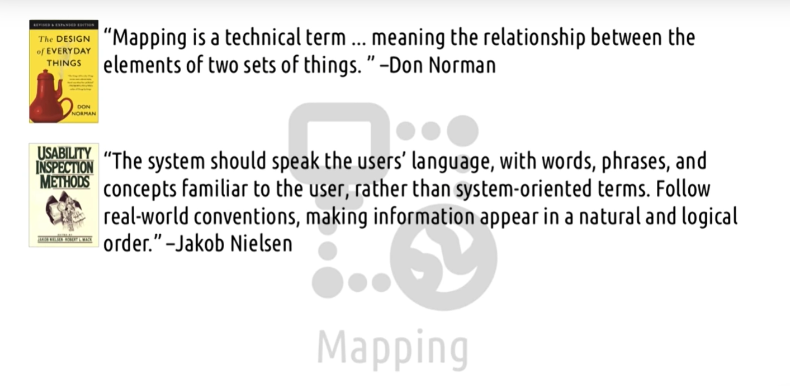

## Mapping vs Affordance

- Affordance - design suggests what to do 
- Mapping - design shows what the effects will be
	- Ex - Light switch
		- Whats the effect?
		- Dials on stove (icon for burners). More clear.

## Additional Principles

- **Perceptibility** - refers to the user's ability to perceive the current state of the system. (On or off in switch). Problem in David's cieling fan
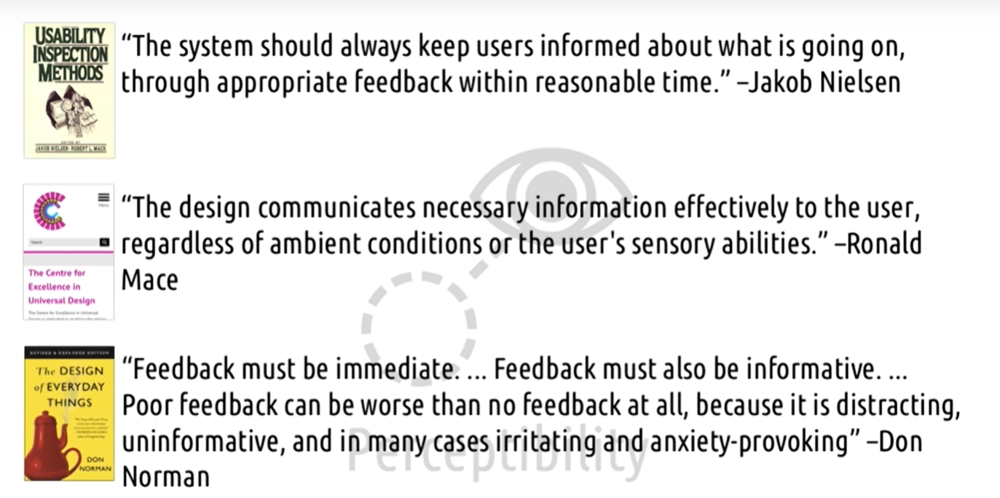

- **Consistency** - we should be consistent both within and across interfaces to minimize the amount of learn the user needs to do to learn our interface; in this way we create affordances on our own.
	- URL in blue in wiki page.
	- Common functions across interfaces.
	- Ordering menus/ Shortcuts in PPT.

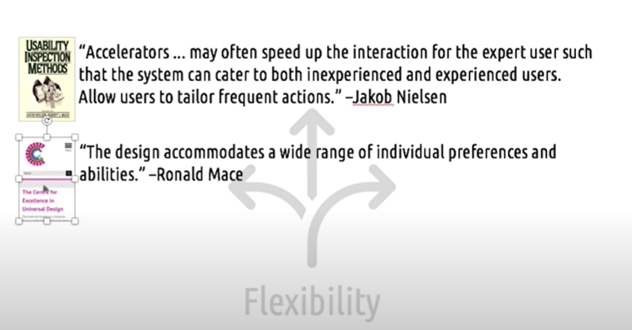

- **Flexibility** - wherever possible, we should support the different interactions in which people engage naturally, rather than forcing them into one against their expertise or against their preference

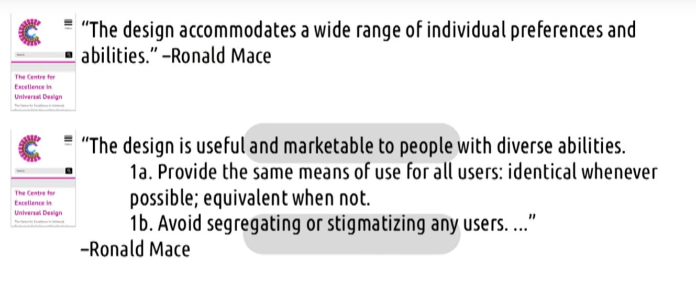

- **Equity** - complementary to flexibility, helping all users have the same user experience. Avoid segregation and stigmatization.

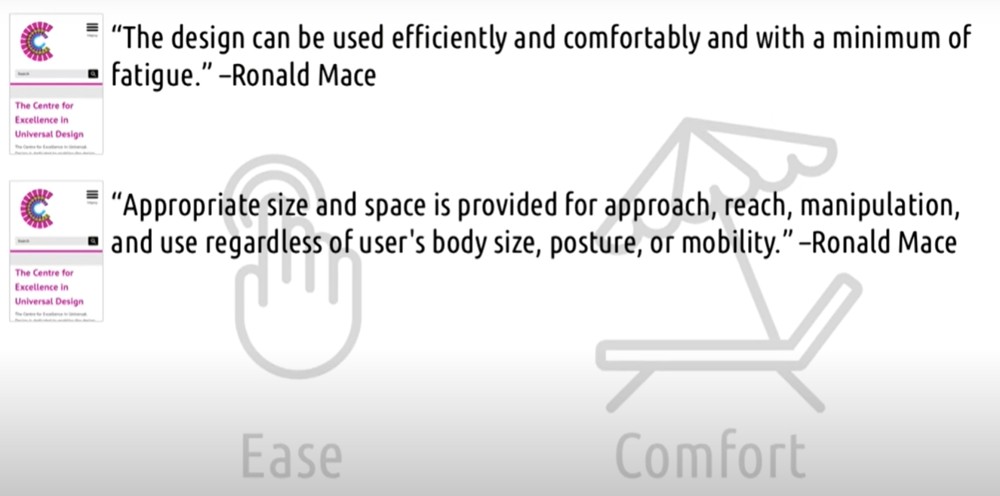

- **Ease and comfort** - the design can be used efficiently an comfortably and with a minimum of fatigue; appropriate size and space is provided for approach, reach, manipulation, and use regardless of user's body size, posture, or mobility

- **Structure** - we should organize our user interfaces in ways that helps the user's mental model match the actual content of the task

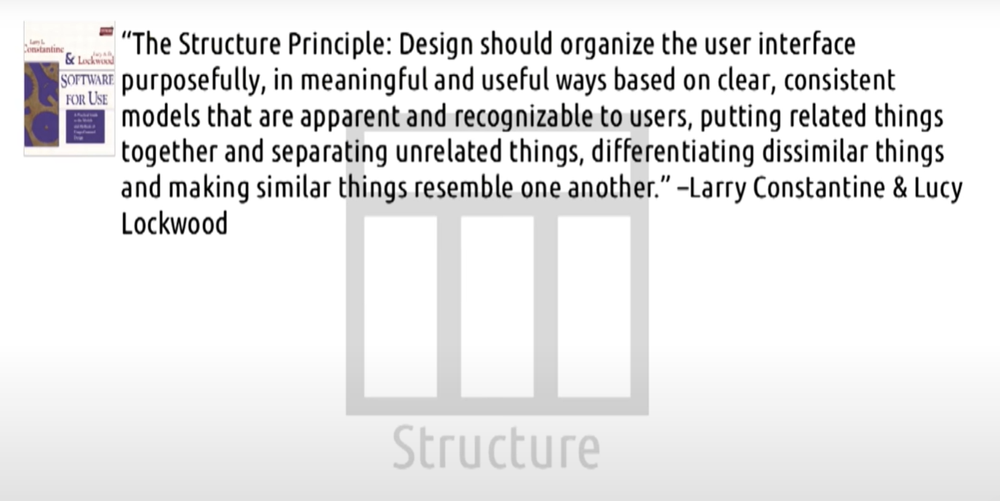

<!--  -->

- **Constraints** - preventing the user from putting an input that wasn't going to work anyway. UI design is transparent. Constraint is visible.

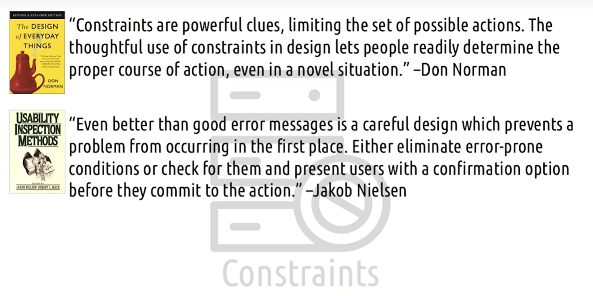

Norman's four types of constraints:

1. Physical - Physically prevent wrong action. USB sticks.
2. Cultural - Line in escalator in Japan.
3. Semantic - Inherent to situation. Purpose of rare view mirror. Must reflect behind.
4. Logical - Self evident based on situation at hand. one hole to one screw.

How do we deal with constraints? There are two ways:

- **Tolerance** - users shouldn't be at risk of causing too much trouble accidentally. Undo and Redo.

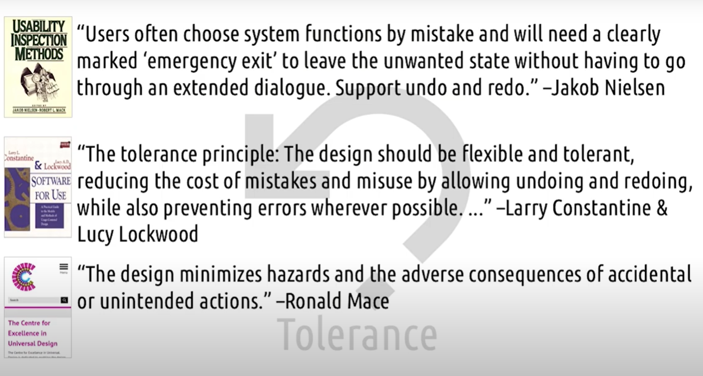

- **Feedback** - user should be informed on why the error happened and how to avoid it in the future

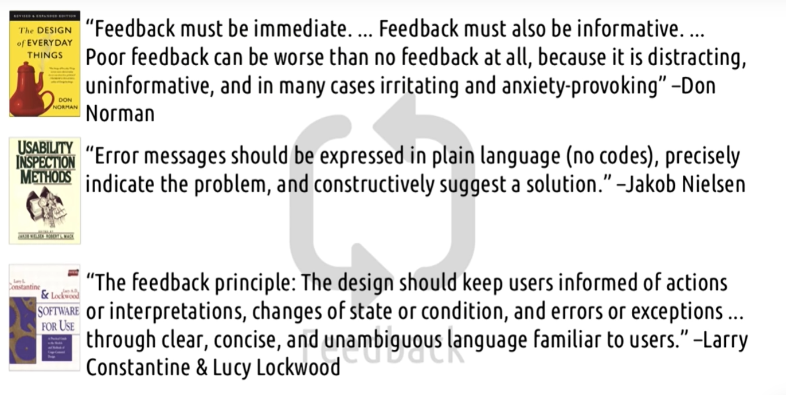

One last heuristic regarding user error:

- **Documentation** - even though it's better if the system can be used without documentation, it may be necessary to provide help and documentation. Any such information should be easy to search, focused on the user's task, list concrete steps to be carried out, and not be too large

## Important videos
* All of them.
* Also need to cross check each of the definitions from mutliple authors for each principles

<!-- ## Section Quizzes

### Design Challenge: Discovering Gestures

_How would you make these gesture commands more discoverable?_

I would have a side tab where when the user touches the feature on their phone they have an option of choosing which functions they would like to be easily accessible. I currently have this feature on my phone and it does not take up a lot of screen real estate.

### Design Challenge: Mapping And Switches

_How would you redesign light switches to create not only affordances but also mappings?_

I would first make the interface a touch interface where each individual light switch for each room is represented by the default _off_ state (a button represented digitally where it is set to off by default). Then when a user touches one of the buttons on the screen, the display would indicate light in which room is turned on.

### Reflections: Constraints

_Can you think of any times you've encountered interfaces that had constraints in them?_

1. When authenticating to BuzzPort, I have to use the Duo Mobile app
2. There is only one bottle cap that fits my water bottle
3. Apple's USB-C chargers not being compatible with my older Android Phone
 -->