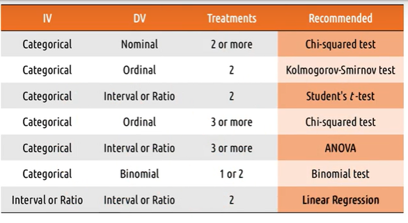

# Lesson 19

This lesson will cover the following topics:

1. **Evaluation** - where we take what we've designed and put it in front of users to get their feedback
2. **Qualitative evaluation** - e.g., what user's like and don't like
3. **Empirical evaluation** - e.g., whether the time to complete a task has changed
4. **Predictive evaluation** - predicting what the results of user evaluation will be

## Three Types Of Evaluation

- **Qualitative evaluation** - evaluation that emphasizes the totality of a phenomenon. Likes dislike need doesnt need, easy vs hard etc.
- **Empirical evaluation** - evaluation based on numeric summaries or observations of a phenomenon. More participants and qualitative is done in prior.
- **Predictive evaluation** - evaluation based on systematic application of pre-established principles and heuristics

## Evaluation Terminology

- **Reliability** - whether a measure consistently returns the same results for the same phenomenon
- **Validity** - whether a measure's results actually reflect the underlying phenomenon (reality and results)
- **Generalizability** - whether a measure's results can be used to predict phenomena beyond what it measured. Broader Audience (may or may not be applicable to all).
- **Precision** - the level of detail a measure supplies

## 5 Tips: What To Evaluate

1. Efficiency - how long does user take to achieve text (Expert)
2. Accuracy - how many users does users commit while executing a task (Expert)
3. Learnability - How long does user take to reach expertise.
4. Memorability - users abiility to remember on how to use interface over time.
5. Satisfaction - Cognitive load, how many actually download the app? - Social desirability bias.

Important things needed to address the research.
- What data are you gathering?
- What are you evaluating ?
- What approach will you use to evaluate?

## Evaluation Timeline

Change in evaluation with time, The evaluation timeline usually is as follows:

Regarding purpose:

1. **Formative** - primary purpose is to help redesign and improve our interface
2. **Summative** - the intention of conclusively saying at the end what the difference was

Regarding approach: Ways to fullfill purpose

1. Qualitative - the goal is to help us improve and understand tasks
2. Predictive - inform how we revise and improve our interface over time (Similar to qualitive evaluation)
3. Empirical - the goal is to demonstrate or assess change

Regarding data:

1. Qualitative - always useful to improve our interfaces.
2. Quantitative - while always useful, can only arise when we have rigorous evaluations.

Regarding setting: where does it take place.

1. Lab testing - helps us focus exclusively on the interface early on
2. Field testing - helps us focus more on the interface in context

## Evaluation Design

1. Define the task - very large or very small task.
2. Define performance measures - how are we going to measure this. Define it and avoid confirmation bias. Create metrics. Qualitative vs Quantitative.
3. Develop the experiment - How we find user performance on the measures. Survey or Interview/ What to control or vary empirically. Generalizability.
4. Recruit participants - Ethics - right awareness
5. Do the experiment
6. Analyze the data - what data tells about performance measures. Do followups if you find something extra than expected.
7. Summarize the data - Informs ongoing process

## Qualitative Evaluation

Get qualitive feedback about the interface. 
There are some questions we want to ask in this evaluation: (Similar to interviews)

1. What did you like/dislike?
2. What were you thinking while using this interface?
3. What was your goal when you took that particular action?

Methods - Interview/Survey/ Think out load protocol/Focus Groups

Use these techniques to get feedback on how our prototype changes the task.

## Designing A Qualitative Evaluation

There are options when designing a qualitative evaluation:

1. Prior experience or live demonstration? - bring user in to test. Mostly later case
2. Synchronous or asynchronous? - watch live or complete and send
3. One interface or multiple prototypes? - Vary the order based on bias.
4. Think aloud protocol or post-event protocol? - explain while doing or do later at the end.
5. Individuals or groups? - Focus groups (build and expand)/ Only source of knowledge (bad) but no bias.

## Capturing Qualitative Evaluation

Options to capture qualitative evaluation:

1. Video recording 
	- Pros; Automated Comprehensive and passive (Focus on admninstering) 
	- Cons: intrusive, nonaalyzalble and screenless. Overwhelming on analyses.
2. Note-taking 
	- Pros: Cheap, Non intrusive (Capture what we do/not everything) and Analyzable
	- Cons: Slow, Manual and Limited
3. Software logging
	- Pros: Automated passive and analyzable
	- Cons: Limited (only some parts could be captured), Narrow and Tech Senistive

## 5 Tips: Qualitative Evaluation

1. Run pilot studies - Recruiting is hard, gather useful data . Use friends and coworkers
2. Focus on feedback - Dont explain rationale, dont teach. Take it and design.
3. Use questions - when user get stuck? Guide user
4. Instruct users what to do, not how - Reduce bias
5. Capture satisfaction - Do they like it?

## Empirical Evaluation

- Something numerical is evaluation? What layout of button is useful?
- Comparing design and showing imprvement in industry.
- Build new theories (gesture has tuf curve than voice)
- How can we show there is a difference between these designs?
- The goal of empirical evaluation is to come up with strong conclusions. Most empirical evaluations are comparisons. 
- In qualitive eval we get ppl  one after another.

## Designing Empirical Evaluation

- **Treatment** - what a participant does in an experiment. Difference interface or design and comparison between them. Difference between two logo should be based on design color should be only comparable.
- **Between subjects design** - comparison between two groups of subjects receiving different treatments. What do participants do or both treatment?
- **Within subjects design** - comparison within one group experiencing multiple treatments. Both treatments are given, what are seen first? order is randomised.
- **Random assignment** - using random chance to decide what treatment each participant receives. Control bias.

## Hypothesis Testing

- Reaction time study? Data is generated and compare this.
- **Hypothesis testing** - testing whether or not the data allows us to conclude a difference exists.

Null= Assume oppose is true
Alternative if data doesnt support that. Less than 5% chance.

## Quantitative Data And Empirical Tests

Recall that there are a number of tests for quantitative data:

1. Nominal:
   - Recommended - Chi-squared test
   - Alternatively: Fisher's exact test, G-test
2. Ordinal:
   - Recommended - Kolmogorov-Smirnov test
   - Alternatively - Chi-squared test, median test
3. Interval and ratio:
   - Recommended - Student's _t_-test
   - Alternatively - MWW test, Kruskal-Wallis test

## Special Test
- Three independent varible (hypothesis) - Do pairwise - Repeated testing - False positive - Falsely reject null and agree alternative hypothesis.
- Fishers exact and G-test
	- Where is the difference?
- ANOVA and Kruskal Wallis (Interval and Ratio)
	- Where is the difference?
Independent variable is Mostly categorical. GPA is interval data.
Binomial Data - Two sample binomial test

## Summary Of Empirical Tests

Below is a summary of empirical tests:

## 5 Tips: Empirical Evaluation

1. Control what you can, document what you can't - Try to make treatments identical as possible
2. Limit your variables - Noisy data false conclusion and monitor handfull of things at a point.
3. Work backwards - Messy and reliability is last and decide question and analysis
4. Script your analyses in advance - Torture data and analyse and conclude. Dont do again
5. Pay attention to power - Size of difference the test can detect.

## Predictive Evaluation

Predictive evaluation should only be used where we wouldn't otherwise be doing any evaluation. Rapid feedback, appropriately and when users are not available.

## Types Of Predictive Evaluation

- **Heuristic evaluation** - each individual evaluator inspects the interface alone, and identifies places where the interface violates some heuristic. Sit with an expert and get the report. 
	- **Model-based evaluation** - tracing through models in the context of the interface we designed (e.g., GOMS model). We can also compare interfaces. Also profiles of users could be used.
	- **Simulation-based evaluation** - where we might construct an AI agent that interacts with our interface in the way a human would.  The human project - IIIT Germany.

## Cognitive Walkthrough

The most common type of predictive evaluation is actually cognitive walkthrough:

- **Cognitive walkthrough** - stepping through the process of interacting with an interface, mentally simulating in each stage what the user is seeing and thinking and doing. To do this, we start with task and goal.
	- predict what action will user take
	- Noting system response
	- Investigate gulf for each step
	- it may be fine for us, but we can put to user shoes we can identify something missing.

## Evaluating Prototypes

Our goal is to constantly apply multiple evaluation techniques to center our designs on the user.
 - Qualtitative evaluation.
 - Some quantitative evaluation.
 - For all the prototypes.

## Important Videos
3,5,7,8,10,12,13,14,15,19